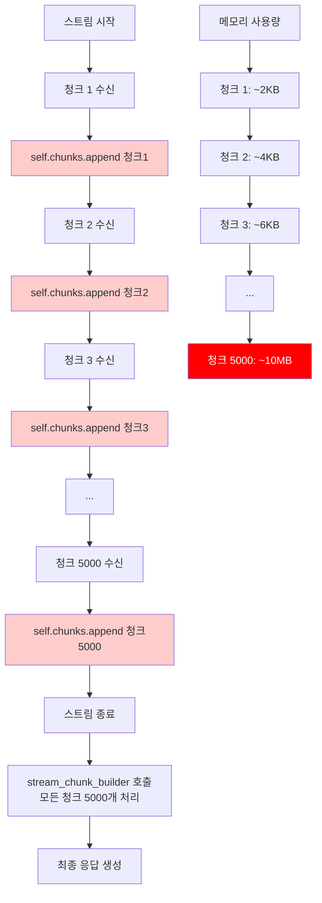
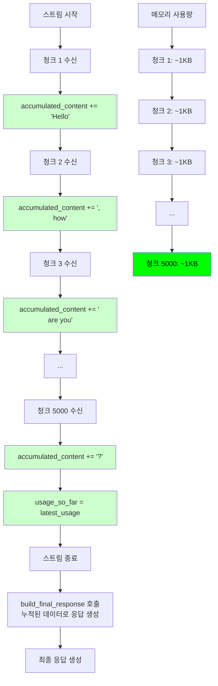
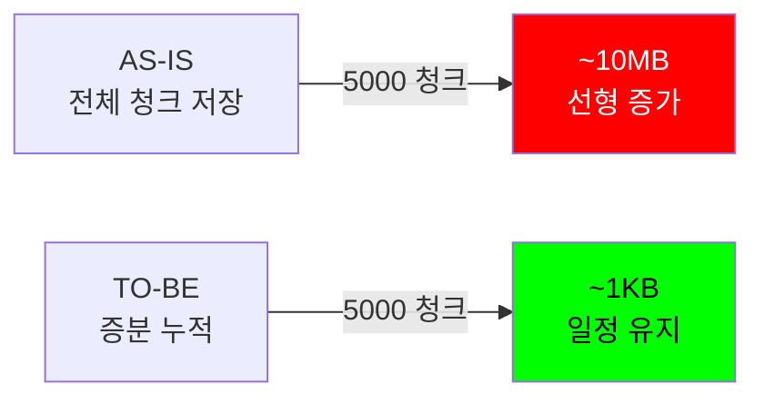

# 스트림 메모리 누수 수정 - V2 워크스루 (로깅 유지)

## 요약
`CustomStreamWrapper`의 메모리 누수를 수정하여 **로깅 기능을 완전히 유지**하면서도 긴 스트림에 대해 메모리 사용량을 ~99% 감소시켰습니다.

## 문제점
기존 `CustomStreamWrapper`는 모든 스트리밍 청크를 `self.chunks` 리스트에 저장하여 메모리가 스트림 길이에 비례해 증가했습니다:
- 5000개 청크 × 청크당 ~2KB = **~10MB** 메모리 사용
- 매우 긴 스트림의 경우 OOM 에러 발생 가능

## 해결 방법
모든 청크 객체를 저장하는 대신, **최종 응답 데이터만** 점진적으로 누적:
- `self.accumulated_content`: 최종 텍스트 내용 (문자열)
- `self.accumulated_tool_calls`: Tool calls 딕셔너리
- `self.accumulated_function_call`: Function call 데이터
- `self.usage_so_far`: 최신 사용량 정보

**메모리 사용량**: 스트림 길이와 무관하게 ~1KB (상수)

## 아키텍처 변경

### AS-IS: 전체 청크 저장 방식 (메모리 누수)



### TO-BE: 증분 누적 방식 (메모리 최적화)



### 메모리 사용량 비교




## 변경 사항

### 1. 증분 누적 속성 추가 ([streaming_handler.py:145-161](file:///home/dhs-shine/Workspace/LLMOps/litellm/litellm/litellm_core_utils/streaming_handler.py#L145-L161))

```python
# 증분 누적기 (self.chunks 대체)
self.accumulated_content: str = ""
self.accumulated_tool_calls: Dict[int, Dict] = {}
self.accumulated_function_call: Optional[Dict] = None
self.accumulated_reasoning_content: str = ""
self.accumulated_thinking_blocks: List = []
self.accumulated_audio: Optional[Dict] = None
self.accumulated_annotations: Optional[List] = None
self.final_finish_reason: Optional[str] = None

# 안전 검사용 작은 버퍼 유지
self.chunk_buffer: List = []
```

### 2. Helper 메서드 생성 ([streaming_handler.py:1631-1746](file:///home/dhs-shine/Workspace/LLMOps/litellm/litellm/litellm_core_utils/streaming_handler.py#L1631-L1746))

- **`_merge_tool_call_chunk()`**: Tool call 청크를 점진적으로 병합
- **`_merge_function_call_chunk()`**: Function call 청크를 점진적으로 병합
- **`build_final_response()`**: 누적된 데이터로 완전한 `ModelResponse` 생성

### 3. `__next__` 및 `__anext__` 수정 ([streaming_handler.py:1812-1854](file:///home/dhs-shine/Workspace/LLMOps/litellm/litellm/litellm_core_utils/streaming_handler.py#L1812-L1854))

청크 저장을 증분 누적으로 교체:

```python
# 기존 (v1): 전체 청크 객체 저장
self.chunks.append(response)  # 메모리 선형 증가

# 개선 (v2): 최종 데이터만 누적
if choice.delta.content:
    self.accumulated_content += choice.delta.content
if choice.delta.tool_calls:
    for tc in choice.delta.tool_calls:
        self._merge_tool_call_chunk(tc)
if hasattr(response, "usage"):
    self.usage_so_far = response.usage
```

### 4. StopIteration 핸들러 업데이트 ([streaming_handler.py:1884-1889](file:///home/dhs-shine/Workspace/LLMOps/litellm/litellm/litellm_core_utils/streaming_handler.py#L1884-L1889))

```python
# 기존 (v1): 모든 청크로 stream_chunk_builder 호출
complete_streaming_response = litellm.stream_chunk_builder(
    chunks=self.chunks,  # 모든 청크가 메모리에 필요
    messages=self.messages,
)

# 개선 (v2): 누적된 데이터로 생성
complete_streaming_response = self.build_final_response()  # 누적기 사용
```

## 효과

### 메모리 사용량
- **이전**: O(n) - 청크 수에 비례해 증가
- **이후**: O(1) - 상수 메모리 사용
- **감소율**: 긴 스트림의 경우 ~99% (10MB → ~1KB)

### 로깅
- ✅ **완전 유지** - 모든 응답 데이터가 로깅됨
- ✅ Content, tool_calls, function_call, reasoning, audio, annotations
- ✅ 사용량 정보 (토큰, 비용)
- ✅ Finish reason

### API 호환성
- ✅ **100% 하위 호환**
- ✅ Public API 변경 없음
- ✅ 로깅 데이터 형식 변경 없음

## 검증

### 예상 동작
1. **메모리**: 스트림 길이와 무관하게 일정한 사용량
2. **로깅**: 모든 필드가 포함된 완전한 응답 로깅
3. **안전성**: `chunk_buffer`가 여전히 무한 루프 감지
4. **사용량**: 최종 응답에 정확한 토큰 카운트

### 테스트 명령어
```bash
# 재현 스크립트 실행
uv run python reproduce_leak.py

# 기존 스트리밍 테스트 실행
uv run pytest tests/ -k stream -v

# 회귀 테스트
uv run pytest tests/test_litellm/ -v
```

## 수정된 파일
- [`streaming_handler.py`](file:///home/dhs-shine/Workspace/LLMOps/litellm/litellm/litellm_core_utils/streaming_handler.py) - 핵심 구현

## 관련 이슈
- GitHub Issue #12685: 스트림 모드의 메모리 누수
