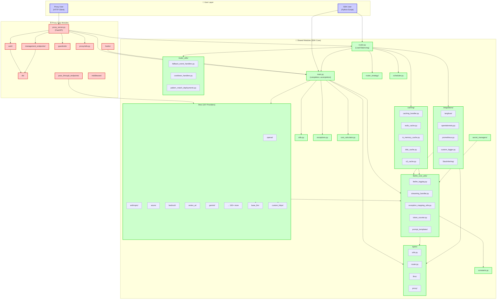
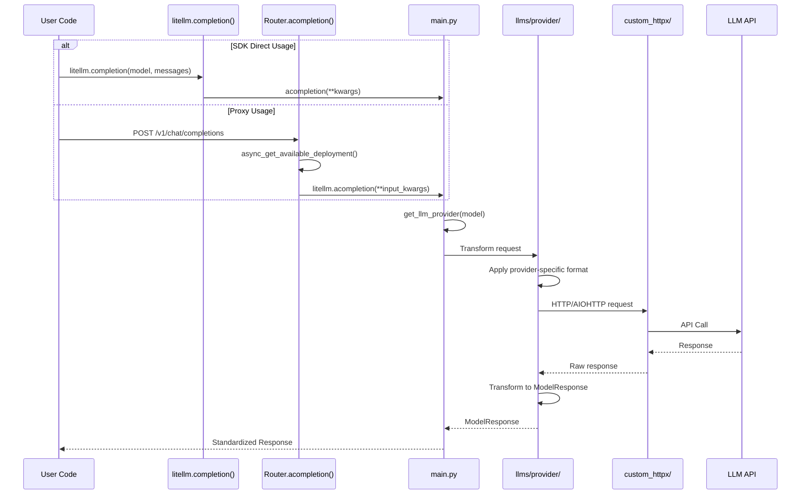
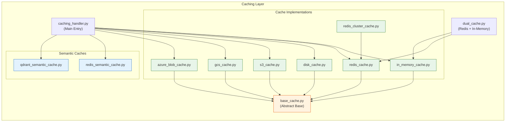

# LiteLLM Module Dependency Architecture

> 이 문서는 LiteLLM 프로젝트의 모듈 간 의존 관계를 상세하게 분석한 결과입니다.

## 패키징 구분

- **SDK Core (Base Package)**: `pip install litellm`로 설치되는 기본 패키지
- **Proxy Extras**: `pip install litellm[proxy]`로 추가 설치되는 Proxy 전용 의존성
- **Extra Proxy**: `pip install litellm[extra_proxy]`로 추가 설치되는 확장 기능

---

## High-Level Architecture Overview



---

## Detailed Module Dependency Diagram

```mermaid
flowchart TB
    subgraph SDK_Package["📦 SDK Package (litellm)"]
        direction TB

        subgraph EntryPoints["Entry Points"]
            Init["__init__.py<br/>(Public API Export)"]
            Main["main.py<br/>(completion, acompletion,<br/>embedding, etc.)"]
            RouterPy["router.py<br/>(Router Class)"]
        end

        subgraph CoreModules["Core Modules"]
            Utils["utils.py<br/>(Helper Functions)"]
            Exceptions["exceptions.py<br/>(Exception Classes)"]
            Constants["constants.py<br/>(Constants & Config)"]
            CostCalc["cost_calculator.py<br/>(Token & Cost Calc)"]
            Timeout["timeout.py"]
            BudgetManager["budget_manager.py"]
        end

        subgraph LitellmCoreUtils["litellm_core_utils/"]
            LiteLLMLogging["litellm_logging.py<br/>(Logging Infrastructure)"]
            StreamingHandler["streaming_handler.py<br/>(SSE Streaming)"]
            ExceptionMapping["exception_mapping_utils.py"]
            TokenCounter["token_counter.py"]
            CoreHelpers["core_helpers.py"]
            GetLLMProvider["get_llm_provider_logic.py"]
            RedactMessages["redact_messages.py"]
            
            subgraph PromptTemplates["prompt_templates/"]
                Factory["factory.py"]
                CommonUtils["common_utils.py"]
            end

            subgraph Tokenizers["tokenizers/"]
                HuggingFace["huggingface_tokenizers.py"]
            end

            subgraph LLMResponseUtils["llm_response_utils/"]
                ConvertDictToResp["convert_dict_to_response.py"]
                GetHeaders["get_headers.py"]
            end
        end

        subgraph LLMProviders["llms/ (107 Providers)"]
            subgraph BaseLLM["base_llm/"]
                BaseModelIterator["base_model_iterator.py"]
                ChatCompletion["chat_completion/"]
                EmbeddingHandler["embedding/"]
                ImageHandler["image_generation/"]
                AudioSTT["audio_transcription/"]
                AudioTTS["text_to_speech/"]
            end

            subgraph CustomHTTPX["custom_httpx/"]
                HTTPHandler["http_handler.py"]
                AIOHTTPHandler["aiohttp_handler.py"]
                LLMHTTPHandler["llm_http_handler.py"]
            end

            subgraph MajorProviders["Major Providers (Detailed)"]
                OpenAI["openai/<br/>(48 files)"]
                Anthropic["anthropic/<br/>(26 files)"]
                Azure["azure/<br/>(28 files)"]
                AzureAI["azure_ai/<br/>(31 files)"]
                Bedrock["bedrock/<br/>(55 files)"]
                VertexAI["vertex_ai/<br/>(66 files)"]
                Gemini["gemini/<br/>(20 files)"]
                Cohere["cohere/<br/>(12 files)"]
            end

            subgraph OtherProviders["Other Providers"]
                Groq["groq/"]
                Mistral["mistral/"]
                Ollama["ollama/"]
                TogetherAI["together_ai/"]
                FireworksAI["fireworks_ai/"]
                Deepseek["deepseek/"]
                Databricks["databricks/"]
                HuggingFace["huggingface/"]
                Replicate["replicate/"]
                Sagemaker["sagemaker/"]
                WatsonX["watsonx/"]
                NvidiaNIM["nvidia_nim/"]
                XAI["xai/"]
                More["... 90+ more"]
            end
        end

        subgraph CachingModule["caching/"]
            CachingPy["caching.py<br/>(Cache Factory)"]
            CachingHandler["caching_handler.py"]
            BaseCache["base_cache.py"]
            InMemoryCache["in_memory_cache.py"]
            RedisCache["redis_cache.py"]
            RedisClusterCache["redis_cluster_cache.py"]
            DiskCache["disk_cache.py"]
            S3Cache["s3_cache.py"]
            GCSCache["gcs_cache.py"]
            AzureBlobCache["azure_blob_cache.py"]
            DualCache["dual_cache.py"]
            SemanticCaches["Semantic Caches<br/>(redis_semantic, qdrant_semantic)"]
        end

        subgraph IntegrationsModule["integrations/"]
            CustomLoggerPy["custom_logger.py<br/>(Base Class)"]
            CustomGuardrail["custom_guardrail.py"]
            
            subgraph ObservabilityIntegrations["Observability"]
                LangfuseInt["langfuse/"]
                OpenTelemetryInt["opentelemetry.py"]
                PrometheusInt["prometheus.py"]
                DatadogInt["datadog/"]
                ArizeInt["arize/"]
                LangsmithInt["langsmith.py"]
                WeaveInt["weave/"]
                LunaryInt["lunary.py"]
                MLFlowInt["mlflow.py"]
            end

            subgraph StorageIntegrations["Storage"]
                S3Int["s3.py"]
                GCSBucketInt["gcs_bucket/"]
                AzureStorageInt["azure_storage/"]
                DynamoDBInt["dynamodb.py"]
            end

            subgraph AlertingIntegrations["Alerting"]
                SlackAlertingInt["SlackAlerting/"]
                EmailAlertingInt["email_alerting.py"]
                PagerDutyInt["(via callbacks)"]
            end

            subgraph PromptMgmtIntegrations["Prompt Management"]
                DotPromptInt["dotprompt/"]
                HumanloopInt["humanloop.py"]
                GenericPromptMgmt["generic_prompt_management/"]
            end
        end

        subgraph RouterUtilsModule["router_utils/"]
            FallbackEventHandlers["fallback_event_handlers.py"]
            CooldownHandlers["cooldown_handlers.py"]
            CooldownCache["cooldown_cache.py"]
            PatternMatchDeploy["pattern_match_deployments.py"]
            BatchUtils["batch_utils.py"]
            ClientInit["client_initalization_utils.py"]
            PreCallChecks["pre_call_checks/"]
        end

        subgraph RouterStrategyModule["router_strategy/"]
            LeastBusy["least_busy.py"]
            LowestLatency["lowest_latency.py"]
            LowestCost["lowest_cost.py"]
            LowestTPM["lowest_tpm_rpm.py"]
            SimpleShuffle["simple_shuffle.py"]
            BudgetLimiter["budget_limiter.py"]
            TagBasedRouting["tag_based_routing.py"]
            AutoRouter["auto_router/"]
        end

        subgraph TypesModule["types/"]
            TypesUtilsPy["utils.py<br/>(ModelResponse, Usage, etc.)"]
            TypesRouterPy["router.py<br/>(Deployment, LiteLLM_Params)"]
            TypesCompletionPy["completion.py"]
            TypesGuardrails["guardrails.py"]
            
            subgraph TypesLLMs["llms/"]
                TypesOpenAI["openai.py"]
                TypesAnthropic["anthropic.py"]
                TypesVertex["vertex_ai.py"]
            end

            subgraph TypesProxy["proxy/"]
                TypesProxyTypes["Various proxy types..."]
            end

            subgraph TypesIntegrations["integrations/"]
                TypesDatadog["datadog.py"]
            end
        end

        subgraph SecretManagersModule["secret_managers/"]
            SecretMain["main.py"]
            AWSSecretsManager["aws_secret_manager.py"]
            AzureKeyVault["azure_key_vault.py"]
            GoogleKMS["google_kms.py"]
            HashicorpVault["hashicorp_vault.py"]
            Infisical["infisical.py"]
        end

        subgraph AdditionalSDKModules["Additional SDK Modules"]
            SchedulerPy["scheduler.py"]
            Responses["responses/"]
            RealTimeAPI["realtime_api/"]
            RerankAPI["rerank_api/"]
            Assistants["assistants/"]
            Files["files/"]
            Batches["batches/"]
            Images["images/"]
            Videos["videos/"]
            OCR["ocr/"]
            RAG["rag/"]
            Search["search/"]
            VectorStores["vector_stores/"]
            Skills["skills/"]
            A2AProtocol["a2a_protocol/"]
        end
    end

    subgraph Proxy_Package["🔒 Proxy Package (litellm[proxy])"]
        direction TB

        subgraph ProxyCore["Proxy Core"]
            ProxyServerPy["proxy_server.py<br/>(FastAPI App)"]
            ProxyCLI["proxy_cli.py"]
            ProxyUtilsPy["utils.py"]
            CommonRequestProc["common_request_processing.py"]
            PreCallUtils["litellm_pre_call_utils.py"]
            RouteRequest["route_llm_request.py"]
        end

        subgraph ProxyAuth["auth/"]
            UserAPIKeyAuth["user_api_key_auth.py"]
            LiteLLMJWT["litellm_jwt.py"]
            AuthChecks["auth_checks.py"]
            OAuthHandler["oauth_handler.py"]
            HandleJWT["handle_jwt.py"]
        end

        subgraph ProxyDB["db/"]
            PrismaClient["prisma_client.py"]
            DBReader["db_reader.py"]
            DBWriter["db_writer.py"]
            DBSpendUpdateWriter["db_spend_update_writer.py"]
            DBTransaction["db_transaction.py"]
            SchemaPrisma["schema.prisma"]
        end

        subgraph ProxyManagement["management_endpoints/"]
            KeyMgmt["key_management_endpoints.py"]
            TeamMgmt["team_endpoints.py"]
            UserMgmt["user_endpoints.py"]
            ModelMgmt["model_management_endpoints.py"]
            OrgMgmt["organizations.py"]
            BudgetMgmt["budget_management_endpoints.py"]
            InternalUserMgmt["internal_user_endpoints.py"]
        end

        subgraph ProxyGuardrails["guardrails/"]
            GuardrailRegistry["guardrail_registry.py"]
            GuardrailHelpers["guardrail_helpers.py"]
            InitGuardrails["init_guardrails.py"]
            
            subgraph GuardrailHooks["guardrail_hooks/"]
                LakeraAI["lakera_ai.py"]
                LLMGuard["llm_guard.py"]
                Presidio["presidio.py"]
                AWSBedrock["bedrock.py"]
                GoogleTextMod["google_text_moderation.py"]
                ContentFilter["litellm_content_filter/"]
            end
        end

        subgraph ProxyPassThrough["pass_through_endpoints/"]
            LLMPassThrough["llm_passthrough_endpoints.py"]
            AnthropicPassThrough["anthropic_passthrough.py"]
            VertexPassThrough["vertex_endpoints.py"]
        end

        subgraph ProxyHooks["hooks/"]
            CacheContolHook["cache_control_check.py"]
            MaxBudgetLimiter["max_budget_limiter.py"]
            PromptInjection["prompt_injection_detection.py"]
            ParallelRequestLimiter["parallel_request_limiter.py"]
            HooksProxy["proxy_hooks.py"]
        end

        subgraph ProxyCommonUtils["common_utils/"]
            CallbackUtils["callback_utils.py"]
            DebugUtils["debug_utils.py"]
            HTTPErrorHandler["http_error_handler.py"]
            AdminUI["admin_ui.py"]
        end

        subgraph ProxySpendTracking["spend_tracking/"]
            SpendTrackingHandler["spend_tracking_utils.py"]
            SpendManagement["spend_management_endpoints.py"]
        end

        subgraph ProxyHealthEndpoints["health_endpoints/"]
            HealthEndpoints["_health_endpoints.py"]
        end

        subgraph ProxyExperimental["_experimental/"]
            UIAssets["out/<br/>(Next.js Dashboard)"]
        end

        subgraph ProxyClient["client/"]
            ClientCLI["cli.py"]
            LocalUI["local_ui/"]
        end

        subgraph ProxyOther["Other Proxy Modules"]
            AgentEndpoints["agent_endpoints/"]
            ImageEndpoints["image_endpoints/"]
            VideoEndpoints["video_endpoints/"]
            RAGEndpoints["rag_endpoints/"]
            ResponsePolling["response_polling/"]
            DiscoveryEndpoints["discovery_endpoints/"]
            ConfigMgmtEndpoints["config_management_endpoints/"]
        end
    end

    %% SDK Internal Dependencies
    Init --> Main
    Init --> RouterPy
    Init --> Utils
    
    Main --> LLMProviders
    Main --> LitellmCoreUtils
    Main --> Exceptions
    Main --> CostCalc
    Main --> TypesModule
    Main --> CachingModule
    
    RouterPy --> Main
    RouterPy --> RouterUtilsModule
    RouterPy --> RouterStrategyModule
    RouterPy --> CachingModule
    RouterPy --> IntegrationsModule
    RouterPy --> SchedulerPy
    
    LLMProviders --> BaseLLM
    LLMProviders --> CustomHTTPX
    LLMProviders --> LitellmCoreUtils
    LLMProviders --> TypesModule
    
    CachingModule --> LitellmCoreUtils
    CachingModule --> BaseCache
    
    IntegrationsModule --> LitellmCoreUtils
    IntegrationsModule --> TypesModule
    IntegrationsModule --> CustomLoggerPy
    
    RouterUtilsModule --> CachingModule
    RouterUtilsModule --> LitellmCoreUtils
    
    RouterStrategyModule --> CachingModule
    
    SecretManagersModule --> LitellmCoreUtils

    %% Proxy to SDK Dependencies
    ProxyServerPy --> RouterPy
    ProxyServerPy --> Main
    ProxyServerPy --> ProxyUtilsPy
    ProxyServerPy --> CommonRequestProc
    ProxyServerPy --> ProxyAuth
    ProxyServerPy --> ProxyManagement
    ProxyServerPy --> ProxyGuardrails
    ProxyServerPy --> ProxyPassThrough
    ProxyServerPy --> ProxyHooks
    
    CommonRequestProc --> RouterPy
    CommonRequestProc --> Main
    CommonRequestProc --> PreCallUtils
    
    ProxyAuth --> ProxyDB
    ProxyAuth --> Utils
    
    ProxyManagement --> ProxyDB
    ProxyManagement --> RouterPy
    
    ProxyGuardrails --> IntegrationsModule
    ProxyGuardrails --> Main
    
    ProxyPassThrough --> LLMProviders
    ProxyPassThrough --> CustomHTTPX
    
    ProxyHooks --> Main
    ProxyHooks --> CachingModule
    
    ProxySpendTracking --> ProxyDB
    ProxySpendTracking --> CostCalc

    classDef sdkCore fill:#e8f5e9,stroke:#2e7d32,stroke-width:2px
    classDef proxyOnly fill:#ffebee,stroke:#c62828,stroke-width:2px
    classDef entryPoint fill:#e3f2fd,stroke:#1565c0,stroke-width:2px,font-weight:bold

    class SDK_Package sdkCore
    class Proxy_Package proxyOnly
    class Init,Main,RouterPy,ProxyServerPy entryPoint
```



---

## LLM Provider Call Flow



---

## Caching Dependency Flow



---

## SDK vs Proxy Module Summary

| Category | Module Path | SDK Package | Proxy Package | Description |
|----------|-------------|:-----------:|:-------------:|-------------|
| **Entry Points** | `main.py` | ✅ | ✅ (via import) | Core LLM API functions |
| | `router.py` | ✅ | ✅ (via import) | Load balancing & routing |
| | `proxy/proxy_server.py` | ❌ | ✅ | FastAPI server |
| **LLM Providers** | `llms/*` (107 providers) | ✅ | ✅ (via import) | Provider implementations |
| **Core Utils** | `litellm_core_utils/*` | ✅ | ✅ (via import) | Logging, streaming, etc. |
| **Caching** | `caching/*` | ✅ | ✅ (via import) | Cache implementations |
| **Integrations** | `integrations/*` | ✅ | ✅ (via import) | Observability & logging |
| **Types** | `types/*` | ✅ | ✅ (via import) | Type definitions |
| **Router Utils** | `router_utils/*` | ✅ | ✅ (via import) | Routing utilities |
| **Authentication** | `proxy/auth/*` | ❌ | ✅ | API key, JWT auth |
| **Database** | `proxy/db/*` | ❌ | ✅ | Prisma ORM, spend tracking |
| **Management** | `proxy/management_endpoints/*` | ❌ | ✅ | Key/Team/Model management |
| **Guardrails** | `proxy/guardrails/*` | ❌ | ✅ | Content filtering |
| **Pass-through** | `proxy/pass_through_endpoints/*` | ❌ | ✅ | Provider-specific forwarding |
| **Dashboard UI** | `proxy/_experimental/out/` | ❌ | ✅ | Next.js admin UI |

---

## pyproject.toml Dependency Classification

### SDK Core Dependencies (Always Installed)
```
httpx, openai, tiktoken, tokenizers, pydantic, jinja2, aiohttp, jsonschema
```

### Proxy Extras (`pip install litellm[proxy]`)
```
uvicorn, uvloop, gunicorn, fastapi, orjson, apscheduler, 
PyJWT, cryptography, websockets, boto3, etc.
```

### Extra Proxy (`pip install litellm[extra_proxy]`)
```
prisma, azure-keyvault-secrets, google-cloud-kms, resend, redisvl
```

---

> [!NOTE]
> SDK Core 모듈들은 Proxy에서 직접 import하여 사용합니다. 
> 따라서 LLM transformation, provider 구현, caching 로직 등은 
> SDK를 직접 사용하든 Proxy를 통해 사용하든 **동일한 코드가 실행**됩니다.
